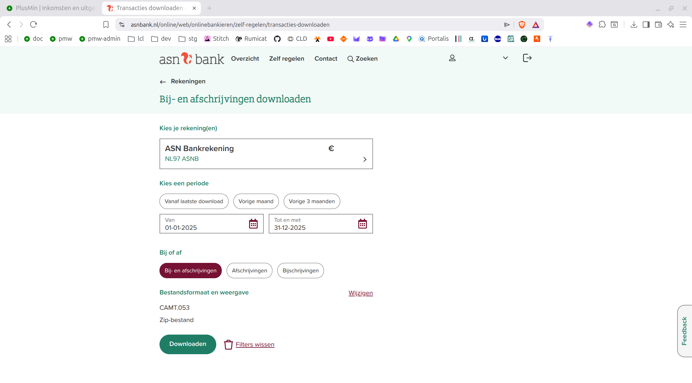
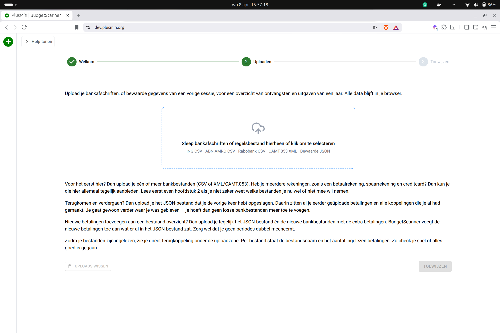
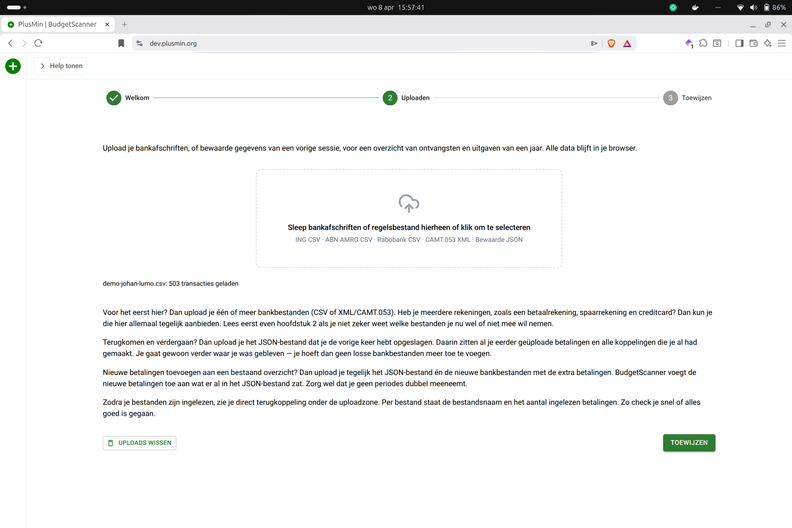
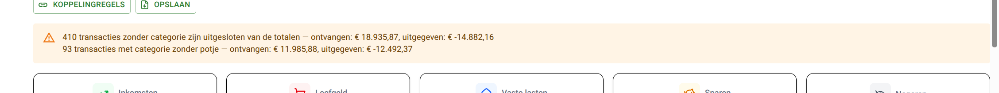
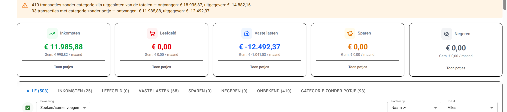
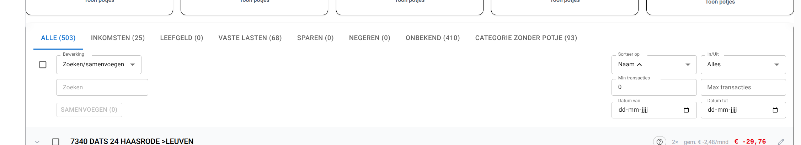
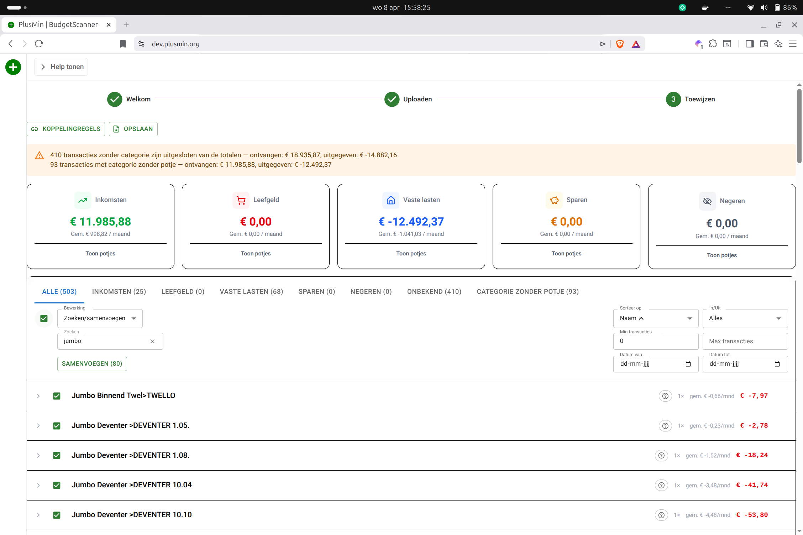
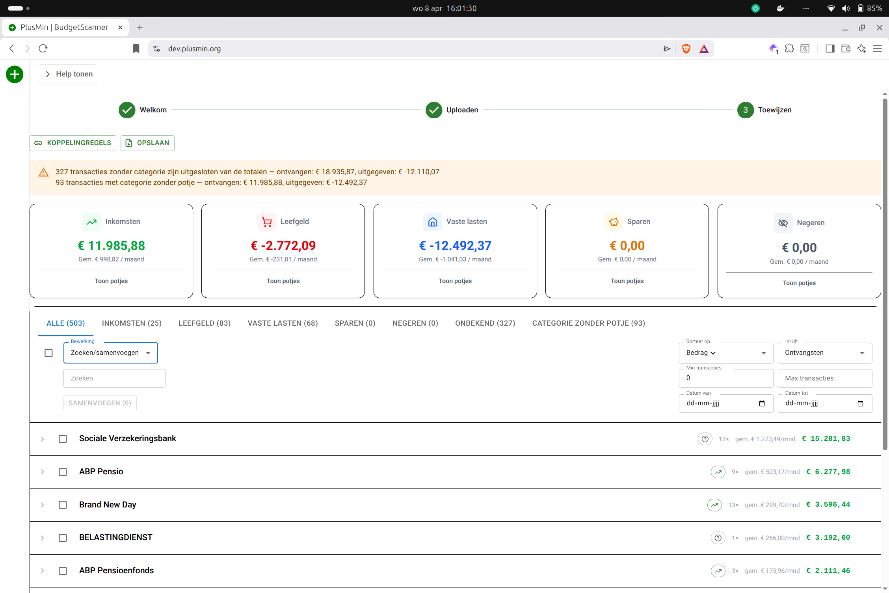
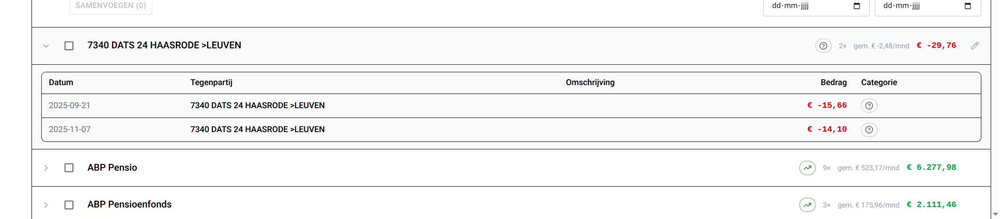

# BudgetScanner

## 1. Wat is BudgetScanner?

[BudgetScanner](#budgetscanner) helpt je om overzicht te krijgen in je [budget](#budget). Het is ideaal als je wilt starten met budgetteren. Je kunt je [betalingen](#betaalgroep) eenvoudig downloaden bij je bank en aanbieden aan de app. Met de app zet je je bankbetalingen om in een duidelijk overzicht van [inkomsten](#inkomsten) en [uitgaven](#uitgaven). Je [koppelt](#toewijzen) elke [betaling](#betaalgroep) aan een [potje](#potje), zodat je goed ziet waar je geld naartoe gaat of vandaan komt.

 met welkomsttekst](images/h1-welkom.png)

Als je de(ze) helptekst wil lezen moet je linksboven, naast het logo, op de knop 'Help tonen' klikken. De linkerhelft van het scherm wordt dan gebruikt voor de help tekst terwijl je rechts in de budgetscanner kunt werken. Je kunt in de help dus het deel zoeken waar je mee bezig bent en het rechts dan ook echt doen. Handig toch? En: alle afbeeldingen zijn klikbaar: als je erop klikt worden ze vergroot. Nog een keer klikken en ze zijn weer klein.

 met helptekst](images/h1-welkom-help.png)

Bovenaan elke pagina staat een zogenaamde [Stepper](#stepper) met 3 stappen: 1 Welkom, 2 Uploaden en 3 [Toewijzen](#toewijzen). De verschillende stappen worden in de rest van de handleiding uitgebreid toegelicht. Je kunt de [Stepper](#stepper) gebruiken om snel naar een andere stap te gaan door op die stap te klikken. Als je nog geen [betalingen](#betaalgroep) hebt geüpload (zie Stap 2), dan is de stap 3 lichtgrijs. Zodra je stap 2 hebt afgerond, wordt de laatste stap ook donkerder en kun je er wel naar toe.

Als je elke [betaling](#betaalgroep) hebt [gekoppeld](#toewijzen) aan een [potje](#potje), kun je de app vragen om een administratie in te richten in de [PlusMin app](#plusmin-app) zelf. Dit is niet verplicht, maar het kan wel. Anders weet je in elk geval welke [budgetten](#budget) voor jou van belang zijn. Je kunt het overzicht opslaan in een overzichtelijk rapport om het altijd na te kunnen kijken.

Als hulpvrager sta jij natuurlijk centraal: jij wilt leren budgetteren en daar kan [BudgetScanner](#budgetscanner) je heel goed bij helpen. Je hoeft niet alles in één keer te begrijpen. Het is heel normaal als dit in het begin redelijk ingewikkeld voelt. Kom je er niet goed uit? Dan kun je altijd ondersteuning vragen aan je [administratiemaatje](#administratiemaatje). Als je geen [administratiemaatje](#administratiemaatje) hebt, kun je contact met ons opnemen: wij kennen veel organisaties die jou kunnen helpen. Het is belangrijk dat je eruit komt, dus zet die stap.

Het belangrijkste doel van [BudgetScanner](#budgetscanner) is:

- op basis van je bestaande [betalingen](#betaalgroep) overzicht krijgen van waar je geld vandaan komt en waar het naartoe gaat
- daardoor je [budgetten](#budget) kunnen inschatten op basis van echte gegevens, bij voorkeur van een jaar
- een administratie aan kunnen maken in [PlusMin app](#plusmin-app) om een vliegende start in de app te hebben

## 2. Stap 1: Welkom {#2-stap-1-welkom}

Voordat je start, is het goed om te weten welke soorten bestanden je kunt gebruiken. In [BudgetScanner](#budgetscanner) werk je met [CSV/XML/CAMT.053](#csvxmlcamt053) en/of [JSON-bestand](#json-bestand).

[CSV/XML](#csvxmlcamt053)-bestanden komen rechtstreeks van je bank. Op dit moment ondersteunen we ABN, ING en Rabo voor de [CSV-bestanden](#csvxmlcamt053). [XML](#csvxmlcamt053), door de bank ook CAMT.053 genoemd, ondersteunen we voor alle banken. Als je bank CAMT.053 aanbiedt, heeft dat daarom de voorkeur. Al die bestanden bevatten alleen [betalingen](#betaalgroep). Meestal is dat per bestand van één bankrekening (of spaarrekening of creditcard) tegelijk.

Kies bij voorkeur een periode van een heel jaar. In een jaar komen (bijna) alle soorten [betalingen](#betaalgroep) een keer voor. Zo mis je minder snel bedragen die niet elke maand terugkomen, zoals vakantiegeld, een eindejaarsbonus of een abonnement dat je maar een keer per jaar betaalt.

Het [JSON-bestand](#json-bestand) is anders. Dat is een bestand dat je eerder vanuit [BudgetScanner](#budgetscanner) hebt opgeslagen. In dit bestand staan alle [betalingen](#betaalgroep) die je toen hebt geüpload (ook als dat van meerdere rekeningen of banken was) en alle [koppelingen](#toewijzen) met [potjes](#potje) die je toen hebt gemaakt. Op die manier kun je doorgaan waar je de vorige keer bent gebleven. Als je de browser sluit terwijl je nog dingen hebt veranderd, waarschuwt de browser. Als je dan *Opslaan als [JSON](#json-bestand)* gebruikt, weet je zeker dat er niets verloren gaat. De knop *Opslaan* zit in de stap *[Toewijzen](#toewijzen)*; daar komen we nog op terug.

Gebruik je een [JSON-bestand](#json-bestand)? Dan heb je doorgaans geen andere bestanden meer nodig, want daar zitten alle [betalingen](#betaalgroep) al in. Alleen als je nieuwe [betalingen](#betaalgroep), van een andere rekening of van andere maanden, wilt toevoegen, heeft dat nut.

Heb je meerdere rekeningen, spaarrekeningen of creditcards? Dan kun je die allemaal aanbieden. De app houdt deze rekeningen uit elkaar. Let op: interne boekingen komen dubbel voor. Een overboeking van rekening A naar rekening B zie je dan vaak twee keer terug. Filter deze dubbele interne boekingen daarom zelf in de stap *[Toewijzen](#toewijzen)* eruit door ze te [negeren](#negeren).

Het is daarom vaak verstandiger niet alle rekeningen te uploaden:

- spaarrekeningen zijn gekoppeld aan een betaalrekening. Als je de betaalrekening hebt geüpload kun je daar precies zien hoeveel je hebt gespaard. Het voegt weinig toe om ze beide te hebben. Let op: vanuit de betaalrekening is het inleggen van spaargeld een betaling en dus negatief. Met andere woorden: hoe negatiever je spaarsaldo, hoe meer je hebt gespaard.
- credit cards zijn ook gekoppeld aan een betaalrekening. Als je de credit card veel, en voor heel verschillende dingen gebruikt kan het goed zijn ook de credit card te uploaden. Je kunt dan elke betaling met de credit card aan een ander potje toewijzen. Gebruik je de credit card voor zelzefde soort dingen? Gebruik dan alleen de betaling van de betaalrekening naar de credit card.
- cash betalingen kun je niet uploaden, want daar heb je geen bestand van. Je hebt het cash geld misschien wel opgenomen van de betaalrekening. Dan kun je die betaling gebruiken om het aan een potje [toe te wijzen](#toewijzen).

Welke rekeningen wel, en welke niet uploaden is best ingewikkeld. Typisch een onderwerp om met je [administratiemaatje](#administratiemaatje) te bespreken.

### Privacy en veiligheid

Je bestanden blijven op je eigen apparaat. [BudgetScanner](#budgetscanner) verwerkt je gegevens in je browser. Je data wordt niet naar een externe server gestuurd.

### Korte samenvatting

Werk je met [CSV/XML](#csvxmlcamt053), dan laad je je bankbetalingen in. Werk je met [JSON](#json-bestand), dan kun je meestal direct verder waar je eerder was gebleven. Kies bij voorkeur een heel jaar, zodat je een compleet beeld krijgt.

## 3. Stap 2: Bestanden uploaden {#3-stap-2-bestanden-uploaden}

In deze stap laad je je bestanden in. Dat kan op twee manieren: sleep bestanden naar de uploadzone, of klik op de zone en kies bestanden vanaf je apparaat. 

Hoe je begint, hangt af van of je hier voor het eerst bent of terugkomt.

**Voor het eerst hier?** Dan upload je één of meer bankbestanden ([CSV](#csvxmlcamt053) of [XML/CAMT.053](#csvxmlcamt053)). Heb je meerdere rekeningen, zoals een betaalrekening, spaarrekening en creditcard? Dan kun je die hier allemaal tegelijk aanbieden. Lees eerst even hoofdstuk 2 als je niet zeker weet welke bestanden je nu wel of niet mee wilt nemen.

**Terugkomen en verdergaan?** Dan upload je het [JSON-bestand](#json-bestand) dat je de vorige keer hebt opgeslagen. Daarin zitten al je eerder geüploade [betalingen](#betaalgroep) en alle [koppelingen](#toewijzen) die je al had gemaakt. Je gaat gewoon verder waar je was gebleven — je hoeft dan geen losse bankbestanden meer toe te voegen.

**Nieuwe betalingen toevoegen aan een bestaand overzicht?** Dan upload je tegelijk het [JSON-bestand](#json-bestand) én de nieuwe bankbestanden met de extra [betalingen](#betaalgroep). [BudgetScanner](#budgetscanner) voegt de nieuwe [betalingen](#betaalgroep) toe aan wat er al in het [JSON-bestand](#json-bestand) zat. Zorg wel dat je geen betalimngen dubbel meeneemt.

Zodra je bestanden zijn ingelezen, zie je direct terugkoppeling onder de uploadzone. Per bestand staat de bestandsnaam en het aantal ingelezen [betalingen](#betaalgroep). Zo controleer je snel of alles goed is gegaan. Bovendien zijn de knoppen 'Toewijzen' 'Uploads wissen' actief geworden. Die kun je nu dus allebei gebruiken. Met 'Uploads wissen' haal je alles weg; je begint eigenlijk weer opnieuw. 

Zie je een foutmelding? Controleer dan of het bestandstype klopt ([CSV](#csvxmlcamt053), [XML/CAMT.053](#csvxmlcamt053) of [JSON](#json-bestand)), of het bestand echt van je bank komt en niet handmatig is aangepast, en of je niet per ongeluk een leeg of beschadigd bestand hebt gekozen. Als het daarna nog niet lukt, download het bestand opnieuw bij je bank en probeer het nog een keer. Kom je er dan nog niet uit, vraag hulp aan je [administratiemaatje](#administratiemaatje).

Als alle bestanden goed zijn ingelezen, ga je door naar stap 3: *[Toewijzen](#toewijzen)*. Dat is de kern van [BudgetScanner](#budgetscanner), daar zet je de [betalingen](#betaalgroep) om naar een overzicht dat voor jou klopt.

### Korte samenvatting {#korte-samenvatting-1}
Begin je voor het eerst, dan upload je bankbestanden ([CSV/XML](#csvxmlcamt053)). Kom je terug, dan upload je je opgeslagen [JSON](#json-bestand). Wil je nieuwe [betalingen](#betaalgroep) toevoegen, dan combineer je beide. Na het uploaden ga je door naar stap 3: *[Toewijzen](#toewijzen)*.

## 4. Stap 3: Categorieën en potjes toewijzen {#4-stap-3-toewijzen}

Dit is de kern van [BudgetScanner](#budgetscanner). Hier geef je aan wat elke [betaling](#betaalgroep) betekent voor jouw [budget](#budget). Je ziet alle [betalingen](#betaalgroep) in groepen, op basis van de naam van de [tegenpartij](#tegenpartij). Per groep [koppel](#toewijzen) je een [categorie](#categorie) en een [potje](#potje).

Als je [betalingen](#betaalgroep) aan een [potje](#potje) [koppelt](#toewijzen), leert de app daarvan. Hij maakt dan een regel aan, zodat [betalingen](#betaalgroep) van die [tegenpartij](#tegenpartij) voortaan automatisch aan dat [potje](#potje) worden [gekoppeld](#toewijzen).

 [toewijzen](#toewijzen) aan [potjes](#potje)](images/h4-toewijzen_annotated.png)

Elk genummerd blok komt terug, in een eigen paragraaf, hieronder.

### 4.1. Knoppen Koppelingsregels en Opslaan {#41-knoppen-koppelingsregels-en-opslaan}

Onder de [stepper](#stepper) staan twee belangrijke knoppen: *Koppelingsregels* en *Opslaan*.

#### Koppelingsregels

In *Koppelingsregels* zie je welke herkenningsregels [BudgetScanner](#budgetscanner) heeft gemaakt om [betalingen](#betaalgroep) automatisch [toe te wijzen](#toewijzen) aan een [categorie](#categorie) en een [potje](#potje).

[BudgetScanner](#budgetscanner) maakt de regels vanzelf aan; daar hoef je niets voor te doen. Je kunt wel zeggen dat je wilt [toewijzen](#toewijzen) [zonder regel](#toewijzen-zonder-regel) omdat een [betaling](#betaalgroep) nooit meer voorkomt. Een regel is dan zinloos. In [Toewijzen zonder regel](#toewijzen-zonder-regel) lees je daar meer over.

Elke regel bevat een patroon op de naam van [tegenpartij](#tegenpartij) (en soms ook de omschrijving). Als een nieuwe [betaling](#betaalgroep) daarbij past, krijgt die automatisch de juiste [koppeling](#toewijzen). Dat scheelt veel handmatig werk. In dit scherm kun je regels nalopen en aanpassen.

Let op: als je de regel verkeerd aanpast, kan het zijn dat hij niet meer werkt.

Je kunt hier ook [potjes](#potje)namen aanpassen. De regel blijft dan bestaan, maar gebruikt de nieuwe naam van het [potje](#potje).

 met patronen per [categorie](#categorie) en [potje](#potje)](images/h4-koppelingsregels.png)

#### Opslaan

Bij *Opslaan* kun je twee soorten bestanden bewaren:

- **JSON**: dit is je werkbestand. Hierin staan alle [betalingen](#betaalgroep), [koppelingen](#toewijzen), regels en [potjes](#potje) die je hebt gemaakt. Wil je later verdergaan? Upload dan je opgeslagen [JSON](#json-bestand) opnieuw in [stap 2: Uploaden](#3-stap-2-bestanden-uploaden). Dan ga je verder waar je was gebleven toen je het bestand bewaarde.
- **PDF**: dit is je rapportbestand. Hierin staat een samenvatting van alle bedragen per [potje](#potje). Gebruik [PDF](#pdf-rapport) vooral om je overzicht terug te lezen, te delen of te bespreken met je [administratiemaatje](#administratiemaatje).

Sla regelmatig op. Als je per ongeluk de pagina sluit nadat je dingen hebt gewijzigd, worden wijzigingen niet bewaard. Je browser waarschuwt je dan. Klik dan op Annuleren en sla op als [JSON](#json-bestand).

Tip: in de naam van het [JSON](#json-bestand)-bestand zitten de datum en tijd wanneer je het hebt opgeslagen. Op die manier kun je makkelijker een specifieke versie terugvinden.

Tip 2: naast de datum en tijd kun je ook meer informatie in de naam stoppen. Bijvoorbeeld: 'leefgeld-gekoppeld'.

### 4.2. Zalmkleurige waarschuwing

De zalmkleurige waarschuwing trekt je aandacht als er nog iets openstaat: [betalingen](#betaalgroep) zonder [categorie](#categorie) of [betalingen](#betaalgroep) zonder [potje](#potje). De [betalingen](#betaalgroep) zonder [categorie](#categorie) kun je bekijken in het tabblad *[Onbekend](#onbekend)*. De [betalingen](#betaalgroep) zonder [potje](#potje) hebben wel al een [categorie](#categorie), maar nog geen [potje](#potje). Die kun je bekijken in het tabblad *[Categorie zonder potje](#categorie-zonder-potje)* (zie [paragraaf 4.5](#45-filteren-sorteren-en-bewerken-h4-5)).

Zie deze melding als een checklist: je bent pas echt klaar als hier geen melding meer staat.

### 4.3. Dashboard met de 5 categorieën

In het dashboard zie je de vijf [categorieën](#categorie): *[Inkomsten](#inkomsten)*, *[Leefgeld](#leefgeld)*, *[Vaste lasten](#vaste-lasten)*, *[Sparen](#sparen)* en *[Negeren](#negeren)*. Deze [categorieën](#categorie) komen straks terug bij het [toewijzen](#toewijzen) van [betalingen](#betaalgroep) aan [potjes](#potje). Elk [potje](#potje) zit in precies 1 van die [categorieën](#categorie).

Dit dashboard geeft een samenvatting. In het dashboard kun je bij elke [categorie](#categorie) de lijst met [potjes](#potje), inclusief de bedragen, openen door op *Toon potjes* te klikken. 

### 4.4. Filteren, sorteren en bewerken {#45-filteren-sorteren-en-bewerken-h4-5}

Hiermee houd je grip op grote aantallen [betalingen](#betaalgroep). Je hoeft niet alles tegelijk te doen: zoek de [betaalgroepen](#betaalgroep) waar nog wat mee moet gebeuren. Met *Filteren* kun je precies die groepen overhouden die je wilt [toewijzen](#toewijzen).

Het lijkt nu waarschijnlijk wat overweldigend, al die mogelijkheden. Het goede nieuws is: je kunt niets kapot maken! Als je een bestand met [betalingen](#betaalgroep) van de bank hebt gedownload, kun je dat telkens opnieuw uploaden in stap 2. Als je voor het uploaden de knop 'Uploads wissen' gebruikt kun je echt opnieuw beginnen. Als je een punt hebt bereikt dat je denkt: 'dit begint ergens op te lijken', sla je het op als [JSON](#json-bestand). Hoe dat werkt, lees je in [paragraaf 4.1](#41-knoppen-koppelingsregels-en-opslaan). Ook met zo'n JSON bestand kun je telkens opnieuw beginnen. Alles wat je had gedaan toen je bestand bewaarde neem je dan ook nog mee.

#### Tabbladen voor categorieën

Bovenaan kun je schakelen tussen tabbladen: *Alle*, *[Inkomsten](#inkomsten)*, *[Leefgeld](#leefgeld)*, *[Vaste lasten](#vaste-lasten)*, *[Sparen](#sparen)*, *[Negeren](#negeren)*, *[Onbekend](#onbekend)* en *[Categorie zonder potje](#categorie-zonder-potje)*. Hiermee **filter** je de [betalingen](#betaalgroep). Achter de naam van de tab staat (tussen haakjes) het aantal [betalingen](#betaalgroep) in die [categorie](#categorie).

*[Onbekend](#onbekend)* en *[Categorie zonder potje](#categorie-zonder-potje)* hebben nog aandacht nodig. Daar haal je de meeste winst, omdat dat de [betalingen](#betaalgroep) zonder [potje](#potje) zijn.

#### Bewerkingen

Onder de tabbladen zit, helemaal links, het *Bewerking*-veld. Je kunt kiezen uit *Zoeken/samenvoegen* (is de standaardkeuze) en *[Toewijzen zonder regel](#toewijzen-zonder-regel)*.

#### Zoeken/samenvoegen 

Als je in het *Zoeken*-veld een deel van een naam invult, blijven in de lijst met [betalingen](#betaalgroep) alleen [betalingen](#betaalgroep) over die **beginnen** met dat zoekwoord. Dat de naam moet beginnen met de opgegeven letters is goed te verklaren. Als je zou zoeken op NS en je vindt alle namen met de letters ns in de naam, krijg je ook Vitens, Transavia en heel veel anderen.

Het kan natuurlijk dat je wel [betalingen](#betaalgroep) wilt overhouden die het zoekwoord midden in de naam hebben. Dan kun je gebruikmaken van een zogenaamde *[wildcard](#wildcard)*: het * (het sterretje dus). Als je het zoekwoord laat beginnen met een *, blijven er veel meer [betalingen](#betaalgroep) over in de lijst. Als je zoekwoord ergens in de naam voorkomt, staat het in de lijst.

Zodra je een zoekwoord hebt ingevuld en je de checkbox helemaal links aanklikt, kun je de 'Samenvoegen'-knop gebruiken. Alle [betalingen](#betaalgroep) in de overgebleven groepen worden dan in één groep gestopt. De naam van die nieuwe groep is de zoekterm die je hebt gebruikt. Ook als er een sterretje in staat.

Samenvoegen is erg handig. Voorbeeld: alle boodschappen die je bij de Jumbo hebt gedaan, hebben een andere naam. Wel begint elke naam met Jumbo. Als je op 'jumbo' zoekt en dan samenvoegt, krijg je alle [betalingen](#betaalgroep) bij de Jumbo in één groep. In paragraaf 4.6 leggen we uit hoe zo'n groep met [betalingen](#betaalgroep) dan in één keer aan het [potje](#potje) 'boodschappen' (of hoe het [potje](#potje) bij jou ook heet) [koppelt](#toewijzen).

Om samen te voegen **moet** je iets in het zoekveld hebben ingevuld. De zoekterm wordt gebruikt als nieuwe naam voor de samengevoegde [betalingen](#betaalgroep). Maak daarom de zoekterm zo lang mogelijk. Dan is de kans klein dat er straks een andere [tegenpartij](#tegenpartij) is met dezelfde zoekterm, terwijl dat over iets heel anders gaat.

#### Toewijzen zonder regel

Voor sommige [betalingen](#betaalgroep) wil je helemaal geen regel maken om [toe te wijzen](#toewijzen). In de paragraaf [Koppelingsregels](#koppelingsregels) staat meer informatie over die regels. Als je op vakantie in een barretje wat hebt gedronken, hoeft dat later nooit meer [gekoppeld](#toewijzen) te worden. Eén keer en nooit weer. Je hebt daar wel geld uitgegeven en wilt het ook aan een [potje](#potje) [toewijzen](#toewijzen), maar [zonder regel](#toewijzen-zonder-regel). 

Kies eerst in het *Bewerking*-veld voor *[Toewijzen zonder regel](#toewijzen-zonder-regel)*. Als je dan een aantal [betaalgroepen](#betaalgroep) kiest (door de checkboxes aan te klikken), wordt de knop 'Toewijzen zonder regel' actief. Als je daar op klikt, kun je kiezen aan welk [potje](#potje) je die [betalingen](#betaalgroep) wilt [toewijzen](#toewijzen). Je kunt alleen kiezen voor [Leefgeld](#leefgeld)-[potjes](#potje). Voor alle andere [categorieën](#categorie) is een regel wel handig.

Het kan zijn dat je een tussenscherm met waarschuwingen krijgt. Lees de waarschuwing en kies om wel of niet door te gaan.

[Toewijzen zonder regel](#toewijzen-zonder-regel) is erg handig als je er bijna bent: je hebt bijna alles [gekoppeld](#toewijzen), maar er blijven losse [betalingen](#betaalgroep) over. Je kiest het tabblad [Onbekend](#onbekend), selecteert ze allemaal en [koppelt](#toewijzen) ze allemaal aan één [potje](#potje). 

#### Aantal betalingen

In de volgende 2 velden kun je het minimum en maximum van het aantal [betalingen](#betaalgroep) in een [betaalgroep](#betaalgroep) kiezen. Dit is handig als je op zoek bent naar [inkomsten](#inkomsten) of [vaste lasten](#vaste-lasten). Als die elke maand terugkomen, zitten er 12 in zo'n groep. 

Let op: niet alle [vaste lasten](#vaste-lasten) komen 12 keer voor. Voorbeeld: GBLT, die gemeentelijke belastingen int, doet dat in 10 maanden. Of: de energieleverancier betaal je 12 x per jaar + de jaarlijkse eindafrekening; 13 x dus. Als je per kwartaal, elke 3 maanden, betaalt, heb je maar 4 [betalingen](#betaalgroep). Enzovoorts.

#### Sorteren

In het sorteren-veld kun je een andere sortering van de [betalingen](#betaalgroep) kiezen: op Naam, [Categorie](#categorie), [Potje](#potje), Aantal [betalingen](#betaalgroep) of Bedrag. Als je nog een keer dezelfde sortering kiest, draait de sortering om.

#### In/Uit

Met In/Uit kun je kiezen of je alleen [Ontvangsten](#inkomsten), alleen [Uitgaven](#uitgaven) of alles wilt zien. Handig om bijvoorbeeld [Inkomsten](#inkomsten) te zoeken die niet zijn herkend.

### 4.5. De betalingen toewijzen aan een potje

In de [betalingen](#betaalgroep)-lijst doe je het echte werk. Hier gaan we de [betaalgroepen](#betaalgroep) [toewijzen](#toewijzen) aan een [potje](#potje). Het is erg simpel.

Zorg eerst dat alle [betalingen](#betaalgroep) die je wilt [toewijzen](#toewijzen) in één groep zitten. Hoe je dat doet, staat in [paragraaf 4.5](#45-filteren-sorteren-en-bewerken-h4-5). Dat is vooral voor het gemak en niet echt noodzakelijk. Hoe meer [betalingen](#betaalgroep) je in 1x kunt [toewijzen](#toewijzen), hoe sneller je klaar bent.

Klik op het potlood-icoontje, helemaal rechts, bij een groep om [toe te wijzen](#toewijzen). Het 'Potjes [toewijzen](#toewijzen)'-schermpje verschijnt.

#### Groepsnaam

Gewoonlijk is de Groepsnaam de naam van de [tegenpartij](#tegenpartij) waar de [betaling](#betaalgroep) naartoe is gegaan of van wie de [betaling](#betaalgroep) is ontvangen. Als je met zoeken en samenvoegen [betalingen](#betaalgroep) in een groep hebt gestopt, is het de zoekterm die je daarvoor hebt gebruikt.

In beide gevallen maakt [BudgetScanner](#budgetscanner) een regel aan dat een [betaling](#betaalgroep) van/naar die Groepsnaam aan het [potje](#potje) wordt [gekoppeld](#toewijzen) dat je straks gaat kiezen.

#### Categorieën

Je kunt kiezen uit 5+1 [categorieën](#categorie). We lopen ze allemaal langs.

#### Inkomsten

[Inkomsten](#inkomsten) zijn (bijna) alle [betalingen](#betaalgroep) die je ontvangt. 

Om met dat 'bijna' te beginnen: als je uit bent geweest, jij hebt betaald, en je hebt Tikkies gestuurd, dan rekenen we die [betalingen](#betaalgroep) niet tot [inkomsten](#inkomsten). Die [koppel](#toewijzen) je aan het [potje](#potje) waar je de [betaling](#betaalgroep) aan hebt [gekoppeld](#toewijzen). Wat dan overblijft, is precies wat je zelf hebt uitgegeven. 

[Inkomsten](#inkomsten) zijn salaris, toeslagen, uitkering, pensioen, AOW, enzovoorts. Voor de meeste mensen krijg je [inkomsten](#inkomsten) elke maand. Maar daar zijn uitzonderingen op. Als ondernemer krijg je heel onregelmatig je [inkomsten](#inkomsten). De facturen die je betaald krijgt, zijn wel gewoon [inkomsten](#inkomsten).

#### Leefgeld en Leefgeld zonder regel

[Leefgeld](#leefgeld)-[uitgaven](#uitgaven) zijn wisselend, zoals boodschappen of vrijetijdsbesteding. Ze komen een paar keer per maand of zelfs week terug. Meestal niet op vaste dagen. Je wilt vooral het inzicht hoeveel je er deze periode nog aan kunt uitgeven. Dat helpt om binnen [budget](#budget) te blijven. 

Je kunt de redenering ook omdraaien: alle [uitgaven](#uitgaven) die niet regelmatig terugkomen en waarvoor je niet hebt gespaard, noemen we [Leefgeld](#leefgeld). 

Als het niet nodig is dat er een regel wordt aangemaakt voor deze [tegenpartij](#tegenpartij), kies je voor [Leefgeld](#leefgeld) [zonder regel](#toewijzen-zonder-regel). De [betaling](#betaalgroep) wordt wel aan een [potje](#potje) [gekoppeld](#toewijzen), maar [zonder regel](#toewijzen-zonder-regel). Een volgende keer wordt de [betaling](#betaalgroep) niet automatisch [gekoppeld](#toewijzen).

#### Vaste lasten

[Vaste lasten](#vaste-lasten) zijn voorspelbare [uitgaven](#uitgaven), zoals huur, abonnementen of de aflossing van een lening. Ze komen periodiek terug (niet per se elke maand), en je wilt gewaarschuwd worden als ze niet op tijd zijn betaald. Vaak zijn [vaste lasten](#vaste-lasten) het resultaat van een contract. Als je niet betaalt, ontstaat er een achterstand. Dat kan hele nare gevolgen hebben.

Dat geldt niet altijd. Een maandelijkse donatie aan een goed doel noemen we ook een [vaste last](#vaste-lasten). Soms kun je het ook opzeggen zonder gevolgen. Voorbeeld: een abonnement op een tijdschrift.

In de [PlusMin app](#plusmin-app) geven we [vaste lasten](#vaste-lasten) daarom een prioriteit. Hoe belangrijker de [vaste last](#vaste-lasten), hoe zorgvuldiger je moet zorgen dat je hem elke keer betaalt. In het [BudgetScanner](#budgetscanner) is dat nog niet van belang: pas als je de PlusMin methodegaat gebruiken wordt het belangrijk.

#### Sparen

[Sparen](#sparen) houdt in dat je bewust een gedeelte van je geld niet direct uitgeeft, maar bewaart voor later. Zo bouw je een veiligheidsnet op voor onverwachte kosten en dingen die je niet in één keer kunt betalen.

[Sparen](#sparen) kan zowel gaan over het geld IN je spaarpot stoppen als er geld UIT halen. Als je de [betalingen](#betaalgroep) van je betaalrekening hebt geüpload, is [sparen](#sparen) een afschrijving (een [uitgave](#uitgaven), want van betaal- naar spaarrekening). Bij het opnemen van spaargeld is het juist een ontvangst (want van spaar- naar betaalrekening). Als je er vervolgens weer wat mee koopt, is dat weer 'gewoon' een [uitgave](#uitgaven).

Als je meer geld hebt gespaard dan dat je aan spaargeld hebt uitgegeven, is [Sparen](#sparen) in het [dashboard](#budgetscanner) dus negatief. Raar maar waar. En als je het weet, hoef je er niet van te schrikken.

#### Negeren

[Negeren](#negeren) is een buitenbeentje in de [categorieën](#categorie). Stel je hebt dit jaar een flinke belastingteruggave gehad. Mazzeltje. Je bent nu aan het budgetteren voor komende jaren. Je verwacht de komende jaren geen andere belastingteruggaven, dus wilt je hem niet meenemen in je [budgetten](#budget). Dan [koppel](#toewijzen) je de [betaling](#betaalgroep) aan [Negeren](#negeren). Dan telt hij niet mee.

Andersom kan natuurlijk ook: je hebt jezelf dit jaar getracteerd op een nieuwe gitaar, omdat je die belastingteruggave had. Dat soort uitspattingen zit er voorlopig niet in. Dan [koppel](#toewijzen) je de gitaar ook aan de [categorie](#categorie) [Negeren](#negeren). 

Als je 2 gekoppelde rekeningen hebt opgevoerd moet je de betalingen van de een naar de ander ook negeren. Stel je hebt een credit card en een betaalrekening. Elke maand vul je de credit card weer aan. Op de betaalrekening is dat een uitgave. Op de credit card een ontvangst. Je kunt ze dan allebei het best negeren.

[Negeren](#negeren) heeft geen [potjes](#potje).

#### Potje

Naast de Groepsnaam en de [Categorie](#categorie) moet de [betaalgroep](#betaalgroep) ook nog aan een [potje](#potje) worden [gekoppeld](#toewijzen). Dat doe je in het onderste veld.

Als je een [categorie](#categorie) hebt gekozen en je klikt in het [Potje](#potje)-veld, zie je alle [potjes](#potje) die nu al aan die [categorie](#categorie) zijn [gekoppeld](#toewijzen). 

Wil je een nieuw [potje](#potje) maken? Typ dan gewoon de naam van het nieuwe [potje](#potje) in. Als je daarna opslaat, wordt het [potje](#potje) automatisch aangemaakt.

Pas wel op voor spelfouten. Als je een bestaand [potje](#potje) op een andere manier spelt, wordt het een nieuw [potje](#potje). Dat is dan niet de bedoeling. Je kunt met [Koppelingsregels](#koppelingsregels) het verkeerd gespelde [potje](#potje) de goede naam geven. Dan is het weer opgelost.

#### Opslaan {#opslaan-1}

Klik daarna op *Opslaan*. De app leert van jouw keuze en kan vergelijkbare [betalingen](#betaalgroep) later automatisch [toewijzen](#toewijzen).

### Korte samenvatting {#korte-samenvatting-2}

In stap 3 Toewijzen geef je aan wat elke [betaling](#betaalgroep) betekent voor jouw [budget](#budget) door de [betalingen](#betaalgroep) [toe te wijzen](#toewijzen) aan een [categorie](#categorie) en een [potje](#potje). De app helpt je hierbij door [betalingen](#betaalgroep) van dezelfde [tegenpartij](#tegenpartij) automatisch in groepen te plaatsen, waarna je per groep een keuze maakt. Door deze [koppelingen](#toewijzen) te maken, leert de app van je keuzes en maakt het automatisch regels aan, zodat toekomstige [betalingen](#betaalgroep) van diezelfde [tegenpartij](#tegenpartij) direct correct worden ingedeeld.

Twee belangrijke knoppen links onder de stepper zijn 'Koppelingsregels' en 'Opslaan'. Via 'Koppelingsregels' kun je zien welke regels de app heeft aangemaakt en eventueel aanpassen. 'Opslaan' geeft je de mogelijkheid om je voortgang te bewaren als een [JSON-bestand](#json-bestand) voor later gebruik of als een [PDF-rapport](#pdf-rapport) om je [budget](#budget) te delen. Als er nog [betalingen](#betaalgroep) zijn die niet aan een [potje](#potje) zijn [gekoppeld](#toewijzen), zie je dat in de zalmkleurige waarschuwing.

Het dashboard toont de vijf hoofd[categorieën](#categorie): [inkomsten](#inkomsten), [leefgeld](#leefgeld), [vaste lasten](#vaste-lasten), [sparen](#sparen) en [negeren](#negeren). Je kunt filteren en sorteren op basis van deze [categorieën](#categorie) om specifiek te zoeken naar [betalingen](#betaalgroep) die nog aandacht nodig hebben, bijvoorbeeld via het tabblad '[Onbekend](#onbekend)'. Met de functie 'Zoeken en samenvoegen' kun je meerdere [betalingen](#betaalgroep) van dezelfde [tegenpartij](#tegenpartij), zoals verschillende boodschappen bij de Jumbo, in één groep samenvoegen om ze vervolgens in één keer aan het juiste [potje](#potje) [toe te wijzen](#toewijzen). Voor eenmalige [uitgaven](#uitgaven), zoals een drankje op vakantie, kun je kiezen voor '[Toewijzen zonder regel](#toewijzen-zonder-regel)', zodat deze [betaling](#betaalgroep) wel wordt geregistreerd maar geen automatische regel creëert voor de toekomst.

Elke [betaalgroep](#betaalgroep) moet uiteindelijk worden [gekoppeld](#toewijzen) aan een van de [categorieën](#categorie) en een specifiek [potje](#potje). [Inkomsten](#inkomsten) zijn ontvangsten zoals salaris.  [Leefgeld](#leefgeld) zijn variabele [uitgaven](#uitgaven) die niet vaststaan. [Vaste lasten](#vaste-lasten) zijn periodieke, voorspelbare kosten zoals huur. [Sparen](#sparen) is geld dat je bewust voor later bewaart. De [categorie](#categorie) '[negeren](#negeren)' is voor eenmalige bedragen die niet meetellen in je huidige [budgetplanning](#budget). Zodra je een [koppeling](#toewijzen) maakt, sla je deze op, waarna de app deze keuze onthoudt voor vergelijkbare toekomstige [betalingen](#betaalgroep).

## 5. Toewijzen in de praktijk

In hoofdstuk 4 is uitgebreid uitgelegd hoe het [toewijzen](#toewijzen) werkt. Maar hoe pak je dit aan in de praktijk? In dit hoofdstuk geven we enkele handvatten om de [koppeling](#toewijzen) van [betalingen](#betaalgroep) aan [potjes](#potje) zo snel mogelijk af te ronden.

Het is verstandig om het aantal niet-[gekoppelde](#toewijzen) [betalingen](#betaalgroep) zo snel mogelijk te verminderen. Uiteindelijk zijn ze dan allemaal verwerkt. Volg hiervoor de onderstaande stappen:

1.  Zodra je je [betalingen](#betaalgroep) van de bank hebt gedownload en in [BudgetScanner](#budgetscanner) hebt geüpload, zijn er waarschijnlijk al enkele herkend. Als je ongeveer twaalf keer hetzelfde bedrag van dezelfde [tegenpartij](#tegenpartij) hebt ontvangen, gaat het waarschijnlijk om [Inkomsten](#inkomsten). Als je twaalf keer hetzelfde bedrag hebt betaald aan dezelfde [tegenpartij](#tegenpartij), zijn dit waarschijnlijk [vaste lasten](#vaste-lasten). Begin met het verwerken van deze groepen: klik op het tabblad [Inkomsten](#inkomsten) en [koppel](#toewijzen) deze aan een [potje](#potje). Doe hetzelfde voor de [vaste lasten](#vaste-lasten). Het is raadzaam om elke [vaste last](#vaste-lasten) een eigen [potje](#potje) te geven.
2.  Zoek naar andere [inkomsten](#inkomsten). Filter op [Ontvangsten](#inkomsten). Let op: niet alle ontvangen [betalingen](#betaalgroep) zijn [inkomsten](#inkomsten). Bij een Tikkie of een retourbetaling bij Bol.com ontvang je wel geld, maar dit telt niet als inkomen.
3.  Zoek de overige [vaste lasten](#vaste-lasten). Filter op het aantal [betalingen](#betaalgroep) en stel dit in op een bereik tussen de 10 en 14. Filter daarna alleen op [Uitgaven](#uitgaven).
4.  Zoek naar [leefgeld](#leefgeld). [Groepeer](#zoekensamenvoegen) de [betalingen](#betaalgroep) bij winkels waar je vaak komt en waar je [leefgeld](#leefgeld) uitgeeft, zoals de supermarkt of de drogist.
5.  Zoek naar [sparen](#sparen). [Sparen](#sparen) is een uitzondering: het opnemen van geld en het [sparen](#sparen) ervan hebben bij de bank vaak verschillende namen.
6.  Zoek naar echt eenmalige [inkomsten](#inkomsten) of [uitgaven](#uitgaven). Deze wil je niet opnemen in je [budget](#budget) en kun je daarom [negeren](#negeren). Pas wel op: een nieuwe wasmachine gaat niet snel kapot, maar is het dit jaar misschien de droger of de koelkast? Bedenk bij een eenmalige [uitgave](#uitgaven) of er soortgelijke situaties kunnen ontstaan en reserveer daarvoor wel geld.
7.  Als het goed is, zijn er nu veel minder [betalingen](#betaalgroep) die niet zijn [gekoppeld](#toewijzen) (zie het tabblad [Onbekend](#onbekend)) en geen [Categorie zonder potje](#categorie-zonder-potje) hebben. Alle andere [betalingen](#betaalgroep) zijn nu aan een [potje](#potje) [gekoppeld](#toewijzen). Nu is het tijd om door de lijst te lopen. Hierin zitten vaak veel eenmalige [uitgaven](#uitgaven) waarvoor geen regel nodig is. Met de optie [Toewijzen zonder regel](#toewijzen-zonder-regel) kun je deze snel selecteren en [toewijzen](#toewijzen). Je kunt eventueel alle resterende [betalingen](#betaalgroep) selecteren via de checkbox naast het menu *Bewerking*. Haal vervolgens de uitzonderingen uit de selectie en [koppel](#toewijzen) de rest [zonder regel](#toewijzen-zonder-regel).
8.  Als alle [betalingen](#betaalgroep) [gekoppeld](#toewijzen) zijn, sla je eerst op als [JSON-bestand](#json-bestand) om je werk niet te verliezen, en daarna als [PDF-rapport](#pdf-rapport). Kijk in het [PDF-rapport](#pdf-rapport) naar uitschieters en probeer deze te verklaren. Dat je in mei (en misschien ook in december) meer [inkomsten](#inkomsten) had, is logisch. Maar hoe zit het met de uitschieter in het [leefgeld](#leefgeld) in augustus? Ga terug naar [BudgetScanner](#budgetscanner), filter op de betreffende [categorie](#categorie) en de maand, en sorteer op bedrag. Uitschieters zitten vaak in hogere bedragen. Heb je een verklaring gevonden? Beslis dan of je bepaalde [betalingen](#betaalgroep) aan een ander [potje](#potje) wilt toewijzen. Blijf zoeken tot je alles kunt verklaren.
9.  Als alle [betalingen](#betaalgroep) [gekoppeld](#toewijzen) zijn en het [PDF-rapport](#pdf-rapport) geen geheimen meer bevat, ben je klaar! Gefeliciteerd, je hebt je [budget](#budget) volledig in kaart gebracht!

### Korte samenvatting {#korte-samenvatting-3}

[Toewijzen](#toewijzen) in de praktijk geeft een aanpak om [betalingen](#betaalgroep) in [BudgetScanner](#budgetscanner) snel aan [potjes](#potje) [toe te wijzen](#toewijzen). Begin met [inkomsten](#inkomsten) en [vaste lasten](#vaste-lasten), omdat deze door [BudgetScanner](#budgetscanner) al zijn herkend. Zoek daarna andere [inkomsten](#inkomsten) en [vaste lasten](#vaste-lasten) via filters, [groepeer](#zoekensamenvoegen) [leefgeld](#leefgeld) bij veelbezochte winkels en [koppel](#toewijzen) [sparen](#sparen). Eenmalige bedragen kun je [negeren](#negeren), maar bedenk wel of er vergelijkbare kosten in de toekomst kunnen ontstaan. Wanneer de meeste [betalingen](#betaalgroep) [gekoppeld](#toewijzen) zijn, verwerk je de resterende eenmalige [uitgaven](#uitgaven) via '[Toewijzen zonder regel](#toewijzen-zonder-regel)'. 

Sla op als [JSON-bestand](#json-bestand) om je werk niet te verliezen en als [PDF-rapport](#pdf-rapport) om uitschieters te analyseren. Zodra alle [betalingen](#betaalgroep) [gekoppeld](#toewijzen) zijn en het rapport geen onverklaarde bedragen meer bevat, ben je klaar.

## Bijlage Woordenlijst

Hieronder vind je de uitleg van de specifieke termen die in deze handleiding worden gebruikt.

#### Administratiemaatje
Een professional of vrijwilliger die een hulpvrager begeleidt naar financiële redzaamheid.

#### BudgetScanner
De applicatie die helpt om inzicht te krijgen in je [budgetten](#budget) door [bankbetalingen](#betaalgroep) om te zetten in een overzicht van [inkomsten](#inkomsten) en [uitgaven](#uitgaven).

#### Betaalgroep
Een verzameling van [betalingen](#betaalgroep) van dezelfde [tegenpartij](#tegenpartij) die door de app automatisch bij elkaar zijn geplaatst.

#### Budget
- eigenschap van elk potje
- voor leefgeld: de begrenzing van de besteding per periode
- voor vaste lasten/aflossing: het bedrag dat wordt afgeschreven, als er wordt afgeschreven; m.a.w.: als er elke 3 maanden € 90 wordt afgeschreven is het budget € 90 ondanks dat er maandelijks maar € 30 opzij wordt gezet; zie ook periodebudget
- voor sparen: het bedrag dat maandelijks opzij wordt gezet; als er een doelbedrag met een doeldatum is gesteld wordt de gebruiker gewaarschuwd als met het budget het doelbedrag op de doeldatum niet wordt gehaald

#### Categorie
Een van de vijf hoofdindelingen voor [betalingen](#betaalgroep): [Inkomsten](#inkomsten), [Leefgeld](#leefgeld), [Vaste lasten](#vaste-lasten), [Sparen](#sparen) of [Negeren](#negeren).

#### Categorie zonder potje
Een tabblad met [betalingen](#betaalgroep) die wel een [categorie](#categorie) hebben, maar nog geen [potje](#potje).

#### CSV/XML/CAMT.053 {#csvxmlcamt053}
Bestandformaten die je van je bank kunt downloaden met je transacties.

#### Inkomsten
[Betalingen](#betaalgroep) die je ontvangt, zoals salaris, toeslagen of pensioen.

#### JSON-bestand
Een werkbestand dat je kunt opslaan om later verder te gaan waar je gebleven was.

#### Koppelingsregels
Regels die de app automatisch aanmaakt om toekomstige [betalingen](#betaalgroep) van dezelfde [tegenpartij](#tegenpartij) automatisch correct [toe te wijzen](#toewijzen).

#### Leefgeld
Variabele [uitgaven](#uitgaven) die niet vaststaan, zoals boodschappen of vrijetijdsbesteding.

#### Negeren
Een [categorie](#categorie) voor eenmalige bedragen die niet meetellen in je huidige [budgetplanning](#budget).

#### Onbekend
Een tabblad met [betalingen](#betaalgroep) die nog geen [categorie](#categorie) hebben gekregen.

#### PDF-rapport
Een rapportbestand met een samenvatting van alle bedragen per [potje](#potje), geschikt om te delen of te bespreken.

#### PlusMin app
De app van PlusMin waarin je, op basis van potjes, een administratie kunt inrichten op basis van de gegevens uit [BudgetScanner](#budgetscanner).

#### Potje
Een onderverdeling binnen een [categorie](#categorie) waar je geld voor een specifiek doel aan [koppelt](#toewijzen), zoals 'boodschappen' of 'vakantie'.

#### Sparen
Geld dat je bewust voor later bewaart, zowel het inleggen als het opnemen van spaargeld.

#### Stepper
De navigatiebalk bovenaan elke pagina met drie stappen: [Welkom](#2-stap-1-welkom), [Uploaden](#3-stap-2-bestanden-uploaden) en [Toewijzen](#4-stap-3-toewijzen).

#### Tegenpartij
De naam van het bedrijf of de persoon waar je geld naar hebt overgemaakt of van hebt ontvangen.

#### Toewijzen
Het aan een [potje](#potje) en een [categorie](#categorie) verbinden van een [betaling](#betaalgroep) of [betaalgroep](#betaalgroep).

#### Toewijzen zonder regel
Een optie om een [betaling](#betaalgroep) aan een [potje](#potje) [toe te wijzen](#toewijzen) zonder dat er een automatische regel wordt aangemaakt voor toekomstige [betalingen](#betaalgroep).

#### Uitgaven
[Betalingen](#betaalgroep) die je doet, zoals boodschappen, huur of abonnementen.

#### Vaste lasten
Voorspelbare, periodieke [uitgaven](#uitgaven) zoals huur, abonnementen of leningaflossingen.

#### Wildcard
Een sterretje (*) in een zoekwoord dat ervoor zorgt dat het zoekwoord ergens in de naam voorkomt, niet alleen aan het begin.

#### Zoeken/samenvoegen
Een functie om [betalingen](#betaalgroep) te filteren op zoekwoorden en meerdere groepen in één nieuwe groep te samenvoegen.